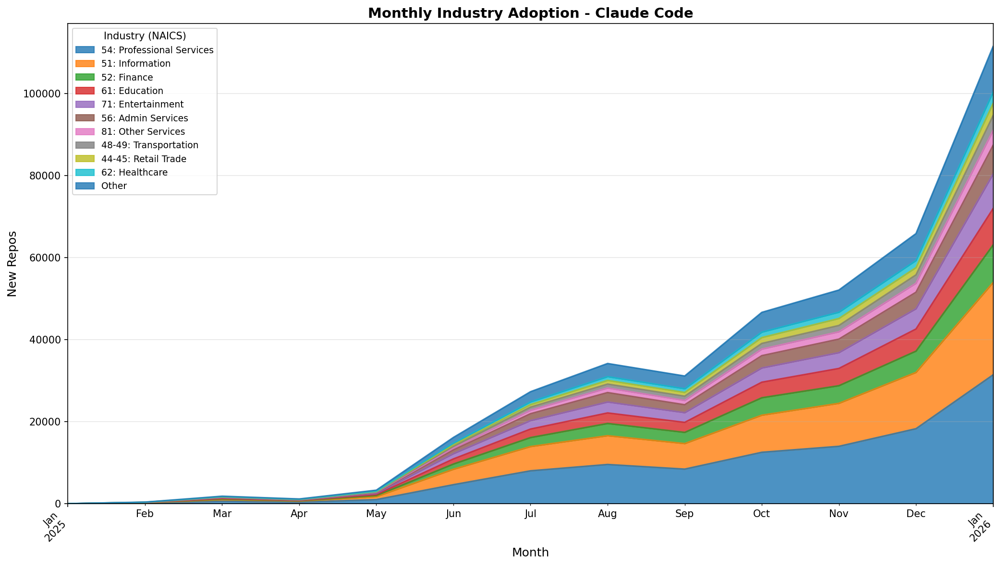
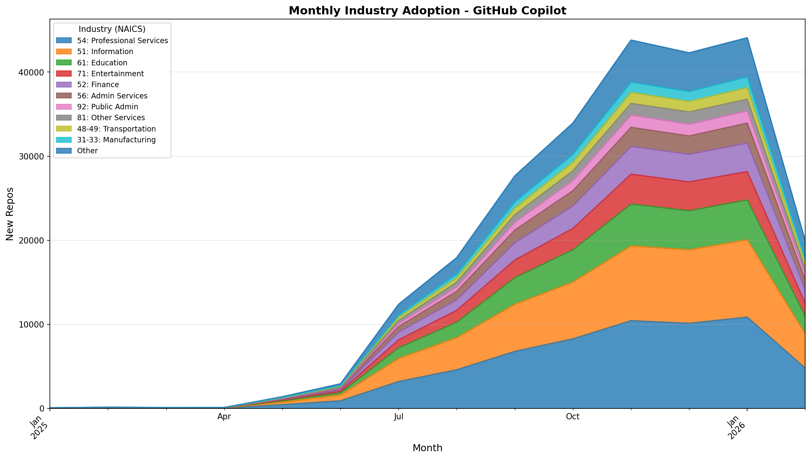
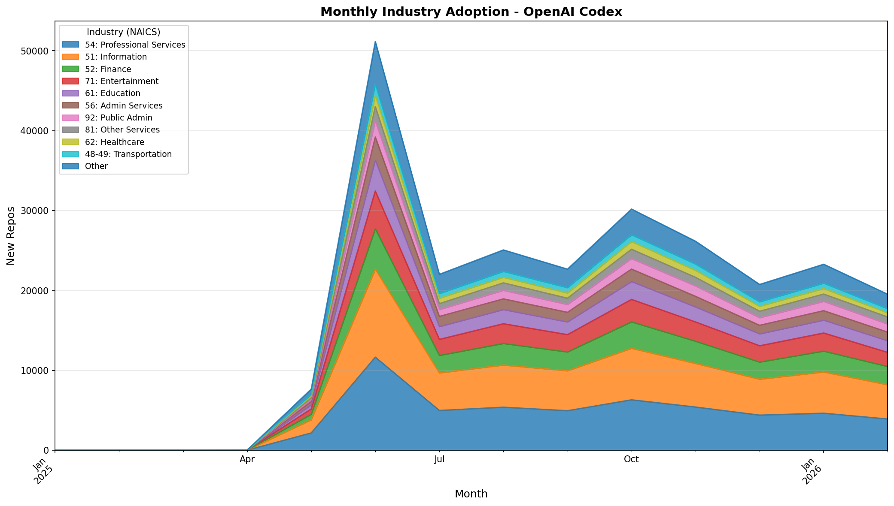
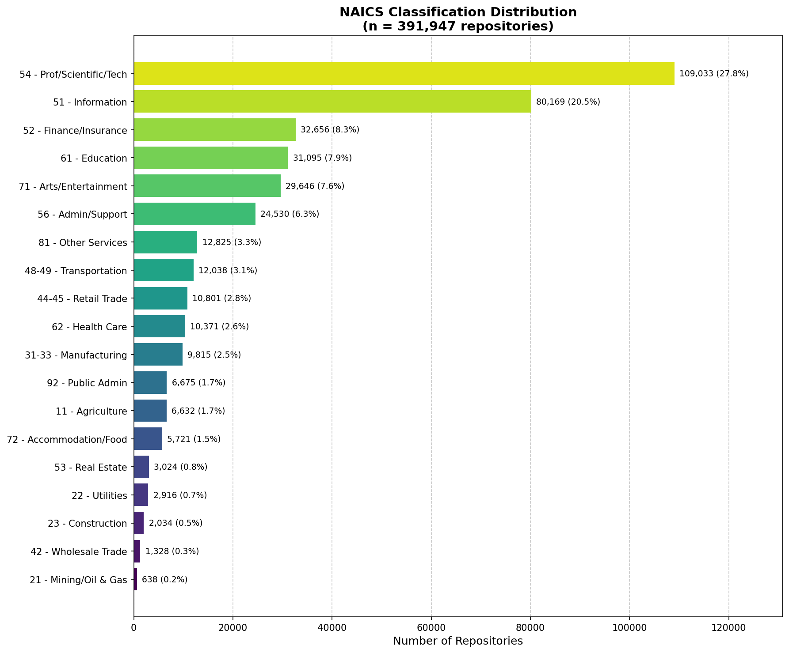
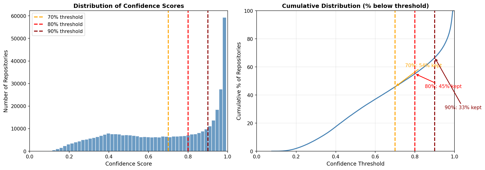

# AI Coding Agents: Industry Adoption Analysis

This repository contains industry classification data and analysis for GitHub repositories using AI coding agents. The analysis covers three major agents: **Claude Code** (Anthropic), **GitHub Copilot** (GitHub/Microsoft), and **OpenAI Codex** (OpenAI).

## Executive Summary

We analyzed adoption patterns of AI coding agents across ~887,000 unique GitHub repositories, classifying each repository by industry using the NAICS (North American Industry Classification System) framework. Key findings:

| Agent | Repos Analyzed | Date Range | Top Industry |
|-------|---------------|------------|--------------|
| Claude Code | 391,492 | Jan 2025 - Jan 2026 | Professional Services (28%) |
| GitHub Copilot | 246,906 | Jan 2025 - Feb 2026 | Professional Services (25%) |
| OpenAI Codex | 248,530 | Jan 2025 - Feb 2026 | Professional Services (22%) |

### Key Findings

1. **Professional Services Dominance**: NAICS sector 54 (Professional, Scientific, and Technical Services) leads adoption across all three agents, consistent with software development being a core activity in this sector.

2. **Information Sector Strong Second**: NAICS sector 51 (Information) consistently ranks second, representing tech companies, publishers, and data processors.

3. **Finance and Healthcare Growing**: Sectors 52 (Finance) and 62 (Healthcare) show accelerating adoption, particularly in recent months.

4. **Claude Code Fastest Growth**: Claude Code shows the steepest adoption curve, particularly in late 2025.

## Industry Adoption Visualizations

### Claude Code


### GitHub Copilot


### OpenAI Codex


### NAICS Distribution


### Confidence Analysis


## Repository Structure

```
ai-coding-agents-industry-analysis/
├── README.md                    # This file
├── METHODOLOGY.md               # Detailed methodology
├── requirements.txt             # Python dependencies
│
├── data/
│   ├── predictions/             # Industry classifications per agent
│   │   ├── claude_predictions.parquet      (391K repos)
│   │   ├── copilot_predictions.parquet     (247K repos)
│   │   └── codex_predictions.parquet       (249K repos)
│   │
│   ├── adoption_timing/         # First use dates per repo
│   │   ├── claude_first_use.parquet        (441K repos)
│   │   ├── copilot_first_use.parquet       (247K repos)
│   │   └── codex_first_use.parquet         (263K repos)
│   │
│   └── samples/                 # High-confidence samples for review
│       └── high_confidence_sample.csv
│
├── figures/                     # Publication-ready visualizations
│
├── scripts/
│   ├── plot_industry_adoption.py    # Main analysis script
│   └── generate_summary_stats.py    # Summary statistics
│
└── src/
    └── naics_mapping.py             # NAICS code reference
```

## Data Dictionary

### Predictions Files (`data/predictions/*.parquet`)

| Column | Type | Description |
|--------|------|-------------|
| `nwo` | string | Repository name with owner (e.g., "owner/repo") |
| `predicted_naics` | string | 2-digit NAICS sector code |
| `confidence` | float | Model confidence score (0-1) |
| `repo_description` | string | GitHub repository description |
| `repo_topics` | list | GitHub repository topics |

### Adoption Timing Files (`data/adoption_timing/*.parquet`)

| Column | Type | Description |
|--------|------|-------------|
| `nwo` | string | Repository name with owner |
| `first_use_date` | datetime | Date of first detected agent usage |

### High Confidence Sample (`data/samples/high_confidence_sample.csv`)

A curated sample of repositories with confidence scores between 70-80% for manual validation of classification accuracy.

## NAICS Sector Reference

| Code | Description |
|------|-------------|
| 11 | Agriculture, Forestry, Fishing and Hunting |
| 21 | Mining, Quarrying, and Oil and Gas Extraction |
| 22 | Utilities |
| 23 | Construction |
| 31-33 | Manufacturing |
| 42 | Wholesale Trade |
| 44-45 | Retail Trade |
| 48-49 | Transportation and Warehousing |
| 51 | Information |
| 52 | Finance and Insurance |
| 53 | Real Estate and Rental and Leasing |
| 54 | Professional, Scientific, and Technical Services |
| 55 | Management of Companies and Enterprises |
| 56 | Administrative and Support Services |
| 61 | Educational Services |
| 62 | Health Care and Social Assistance |
| 71 | Arts, Entertainment, and Recreation |
| 72 | Accommodation and Food Services |
| 81 | Other Services |
| 92 | Public Administration |

## Reproducing the Analysis

### Prerequisites

```bash
pip install -r requirements.txt
```

### Regenerate Charts

```bash
python scripts/plot_industry_adoption.py
```

### Generate Summary Statistics

```bash
python scripts/generate_summary_stats.py
```

## Data Collection

- **Source**: GitHub API (public repositories only)
- **Detection Method**: Commit messages, PR titles, and Co-Author tags indicating agent usage
- **Classification Model**: Fine-tuned transformer model trained on labeled repository-to-industry mappings
- **Time Period**: January 2025 - February 2026

For detailed methodology, see [METHODOLOGY.md](METHODOLOGY.md).

## Limitations

1. **Public Repositories Only**: Analysis limited to public GitHub repositories; enterprise/private usage not captured.

2. **Detection Accuracy**: Agent usage detection based on commit/PR metadata may miss implicit usage.

3. **Classification Confidence**: Industry classification based on repository metadata; some repositories may be miscategorized.

4. **Self-Selection Bias**: Developers who publicly attribute AI agent usage may differ from average users.

## Contact

For questions about this analysis, please open an issue in this repository.

## License

Data and analysis provided for research purposes. See individual data sources for their respective terms of use.
