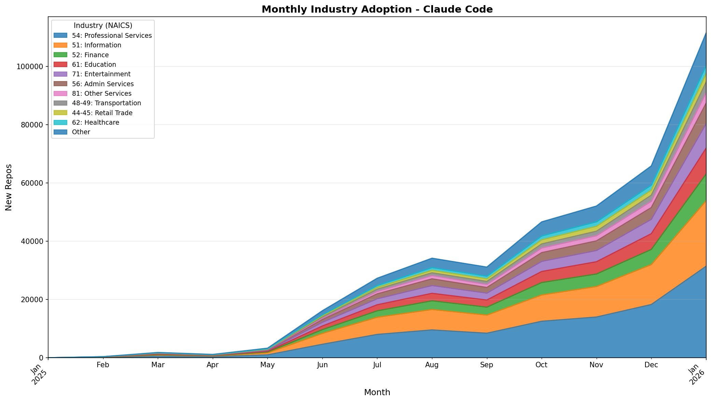
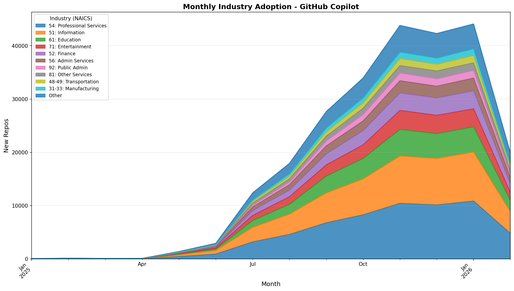
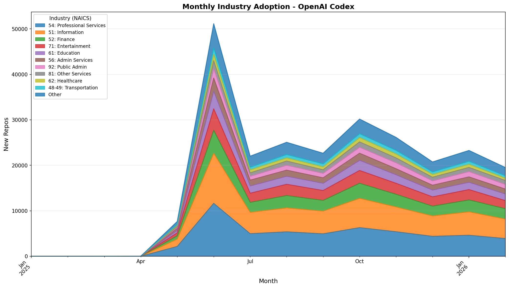
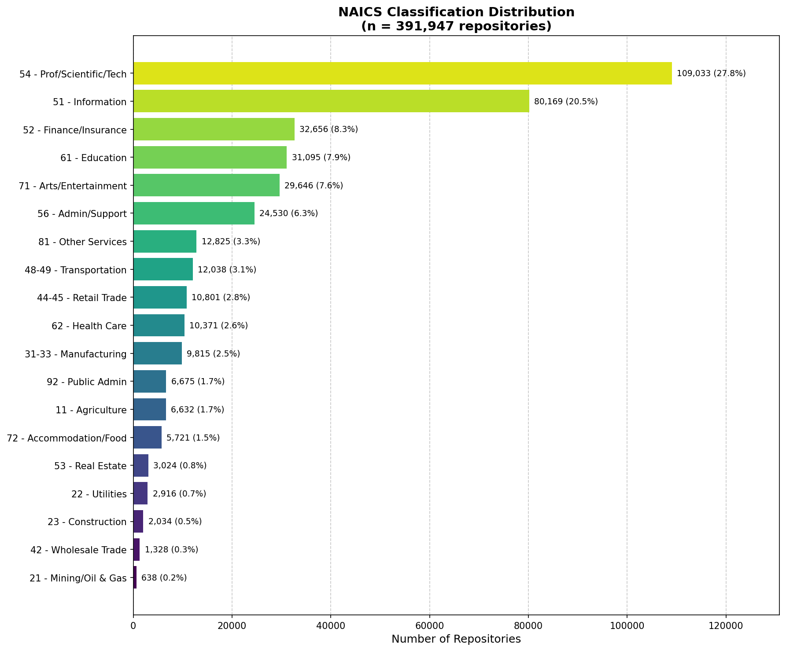
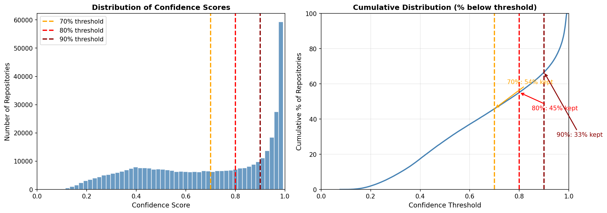

# AI Coding Agents: Industry Adoption Analysis

## Live Dashboard

Interactive dashboard: [https://alexanderquispe.github.io/ai-coding-agents-industry-analysis/](https://alexanderquispe.github.io/ai-coding-agents-industry-analysis/)

Built with Next.js 16, Recharts, and NAICS classification. Data updates daily via GitHub Actions.

---

This repository contains industry classification data and analysis for GitHub repositories using AI coding agents. The analysis covers four major agents: **Claude Code** (Anthropic), **GitHub Copilot** (GitHub/Microsoft), **OpenAI Codex** (OpenAI), and **Cursor AI** (Anysphere).

## Executive Summary

We analyzed adoption patterns of AI coding agents across ~1,000,000+ unique GitHub repositories, classifying each repository by industry using the NAICS (North American Industry Classification System) framework. Key findings:

| Agent | Repos Analyzed | Date Range | Top Industry |
|-------|---------------|------------|--------------|
| Claude Code | 391,492 | Jan 2025 - Mar 2026 | Professional Services (28%) |
| GitHub Copilot | 246,906 | Jan 2025 - Mar 2026 | Professional Services (25%) |
| OpenAI Codex | 248,530 | Jan 2025 - Mar 2026 | Professional Services (22%) |
| Cursor AI | 128,761 | Jan 2025 - Mar 2026 | Professional Services (24%) |

### Key Findings

1. **Professional Services Dominance**: NAICS sector 54 (Professional, Scientific, and Technical Services) leads adoption across all three agents, consistent with software development being a core activity in this sector.

2. **Information Sector Strong Second**: NAICS sector 51 (Information) consistently ranks second, representing tech companies, publishers, and data processors.

3. **Finance and Healthcare Growing**: Sectors 52 (Finance) and 62 (Healthcare) show accelerating adoption, particularly in recent months.

4. **Claude Code Fastest Growth**: Claude Code shows the steepest adoption curve, particularly in late 2025.

## Industry Adoption Visualizations

### Claude Code


### GitHub Copilot


### OpenAI Codex


### NAICS Distribution


### Confidence Analysis


## Repository Structure

```
ai-coding-agents-industry-analysis/
├── README.md                    # This file
├── METHODOLOGY.md               # Detailed methodology
├── requirements.txt             # Python dependencies
│
├── bulk-fetch/                  # Data collection scripts
│   ├── fetch_bulk.py                # Multi-agent bulk fetcher (commits + PRs)
│   ├── fetch_repo_metadata.py       # Repo metadata enrichment (GraphQL)
│   └── repair_claude_checkpoints.py # One-time checkpoint repair script
│
├── data/
│   ├── predictions/             # Industry classifications per agent
│   │   ├── claude_predictions.parquet      (391K repos)
│   │   ├── copilot_predictions.parquet     (247K repos)
│   │   └── codex_predictions.parquet       (249K repos)
│   │
│   ├── adoption_timing/         # First use dates per repo
│   │   ├── claude_first_use.parquet        (441K repos)
│   │   ├── copilot_first_use.parquet       (247K repos)
│   │   └── codex_first_use.parquet         (263K repos)
│   │
│   └── samples/                 # High-confidence samples for review
│       └── high_confidence_sample.csv
│
├── output/                      # Raw commit/PR data from bulk fetcher
│   ├── claude_commits.parquet          (176K commits — partial, see note)
│   ├── copilot_commits.parquet         (77K commits)
│   ├── copilot_prs.parquet             (212K PRs)
│   ├── codex_commits.parquet           (1.5K commits)
│   ├── codex_prs.parquet               (266K PRs)
│   ├── cursor_commits.parquet          (23K commits)
│   ├── cursor_prs.parquet              (20K PRs)
│   ├── monthly_adoption_*.csv          # Monthly adoption curves
│   ├── industry_breakdown_*.csv        # NAICS sector distributions
│   └── overview.csv                    # Cross-agent summary
│
├── checkpoints/                 # Fetch progress tracking
│   ├── manifest_*.json                 # Per-day completion status
│   └── seen_keys_*.txt                 # Deduplication keys
│
├── docs/
│   └── research_design_did_event_study.md  # DiD/Event Study research design
│
├── figures/                     # Publication-ready visualizations
│
├── scripts/
│   ├── plot_industry_adoption.py    # Main analysis script
│   └── generate_summary_stats.py    # Summary statistics
│
└── src/
    └── naics_mapping.py             # NAICS code reference
```

## Data Dictionary

### Predictions Files (`data/predictions/*.parquet`)

| Column | Type | Description |
|--------|------|-------------|
| `nwo` | string | Repository name with owner (e.g., "owner/repo") |
| `predicted_naics` | string | 2-digit NAICS sector code |
| `confidence` | float | Model confidence score (0-1) |
| `repo_description` | string | GitHub repository description |
| `repo_topics` | list | GitHub repository topics |

### Adoption Timing Files (`data/adoption_timing/*.parquet`)

| Column | Type | Description |
|--------|------|-------------|
| `nwo` | string | Repository name with owner |
| `first_use_date` | datetime | Date of first detected agent usage |

### High Confidence Sample (`data/samples/high_confidence_sample.csv`)

A curated sample of repositories with confidence scores between 70-80% for manual validation of classification accuracy.

## NAICS Sector Reference

| Code | Description |
|------|-------------|
| 11 | Agriculture, Forestry, Fishing and Hunting |
| 21 | Mining, Quarrying, and Oil and Gas Extraction |
| 22 | Utilities |
| 23 | Construction |
| 31-33 | Manufacturing |
| 42 | Wholesale Trade |
| 44-45 | Retail Trade |
| 48-49 | Transportation and Warehousing |
| 51 | Information |
| 52 | Finance and Insurance |
| 53 | Real Estate and Rental and Leasing |
| 54 | Professional, Scientific, and Technical Services |
| 55 | Management of Companies and Enterprises |
| 56 | Administrative and Support Services |
| 61 | Educational Services |
| 62 | Health Care and Social Assistance |
| 71 | Arts, Entertainment, and Recreation |
| 72 | Accommodation and Food Services |
| 81 | Other Services |
| 92 | Public Administration |

## Reproducing the Analysis

### Prerequisites

```bash
pip install -r requirements.txt
```

### Regenerate Charts

```bash
python scripts/plot_industry_adoption.py
```

### Generate Summary Statistics

```bash
python scripts/generate_summary_stats.py
```

## Data Collection

- **Source**: GitHub API (public repositories only)
- **Detection Method**: Commit messages, PR titles, and Co-Author tags indicating agent usage
- **Classification Model**: Fine-tuned transformer model trained on labeled repository-to-industry mappings
- **Time Period**: January 2025 - February 2026

For detailed methodology, see [METHODOLOGY.md](METHODOLOGY.md).

---

## DiD / Event Study: Does Claude Code Expand Developers' Frontier?

### Motivation

Anecdotal evidence suggests AI coding assistants enable developers to work in programming languages and industry sectors outside their prior expertise. We test this formally using a difference-in-differences design exploiting the staggered adoption of Claude Code across 185K+ developers.

### Hypotheses

- **H1**: Claude Code adoption causes developers to code in more programming languages
- **H2**: Claude Code adoption causes developers to contribute to repos in more diverse industry sectors
- **H3**: These effects are stronger for developers who were more specialized before adoption

### Data Pipeline Status

| Step | Description | Status | Output |
|------|-------------|--------|--------|
| **Raw commits** | 7.8M Claude co-authored commits (Jan 2025 – Jan 2026) | Done | `github-repo-fetcher/data/output/claude_commits_full.jsonl` |
| **Step 0** | Treatment panel: 185,517 developers with adoption dates | Done | `github-repo-fetcher/data/output/developer_treatment_panel.parquet` |
| **Step 1** | Stratified sample of 5,000 treated developers (Q2–Q3 2025, >=5 commits) | Done | `github-repo-fetcher/data/output/treated_sample_5000.parquet` |
| **Step 2a** | Fetch treated developers' monthly activity via GraphQL (28 months × 5K) | Done (80 min) | `github-repo-fetcher/data/output/developer_activity_monthly.parquet` |
| **Step 2b** | Fetch control developers' monthly activity via GraphQL (28 months × 5K) | Done (~80 min) | same file (appended) |
| **Step 3** | Control group: 5,000 not-yet-treated developers (Q4-2025/Q1-2026 adopters) | Done | `github-repo-fetcher/data/output/control_sample_5000.parquet` |
| **Step 4** | Developer × month panel with outcome variables (228K rows) | Done | `github-repo-fetcher/data/output/did_panel.parquet` |
| **Step 5** | Run Callaway & Sant'Anna (2021) staggered DiD estimator | Pending | — |

### Treatment Panel Summary

Built from `claude_commits_full.jsonl` (7,786,771 commits):

| Metric | Value |
|--------|-------|
| Total developers | 185,517 |
| Date range | Jan 2025 – Jan 2026 |
| Adoption by quarter | Q1: 1,557 / Q2: 11,894 / Q3: 46,700 / Q4: 73,151 / Q1-2026: 52,215 |

### Treated Sample (5,000 developers)

Selected from Q2–Q3 2025 adopters (best pre/post coverage):

| Criterion | Value |
|-----------|-------|
| Eligible pool | 36,718 developers |
| Adoption window | April – September 2025 |
| Minimum Claude commits | 5 |
| Intensity balance | ~1,667 each: low (5–10), medium (11–50), high (50+) |
| Sampling rate | ~13.6% of eligible |

### Control Sample (5,000 developers — not-yet-treated)

Selected from Q4-2025/Q1-2026 adopters (had NOT adopted during treated group's treatment window):

| Criterion | Value |
|-----------|-------|
| Eligible pool | 65,467 developers |
| Adoption window | October 2025 – January 2026 |
| Earliest Claude commit | 2025-10-01 (after all treated developers adopted) |
| Minimum Claude commits | 5 |
| Intensity balance | ~1,667 each: low (5–10), medium (11–50), high (50+) |

### Activity Data Collected

| Dataset | Developers | Active Rows | Unique Repos | Time to Fetch |
|---------|-----------|-------------|--------------|---------------|
| Treated activity | 4,085 (of 5,000) | ~124K | ~56K | 80 min |
| Control activity | 4,067 (of 5,000) | ~84K | ~48K | ~80 min |
| **Combined** | **8,152** | **208,629** | **96,033** | ~160 min |

~18% of developers failed (deleted/private accounts since commits were made).

### DiD Panel

**File:** `github-repo-fetcher/data/output/did_panel.parquet` (228,256 rows = 8,152 developers × 28 months)

| Outcome Variable | Description | Treated Mean | Control Mean |
|-----------------|-------------|-------------|-------------|
| `n_languages` | Distinct languages this month | 0.63 | 0.43 |
| `language_entropy` | Shannon entropy across languages | 0.09 | 0.06 |
| `n_new_languages` | New languages never used before | 0.14 | 0.11 |
| `n_repos` | Distinct repos this month | 1.09 | 0.74 |
| `n_commits` | Total commits this month | 21.32 | 14.61 |
| `cumulative_languages` | Total languages ever used | 1.96 | 1.36 |

### Preliminary Signal

Raw average `n_languages` by event time for treated group shows a clear jump at adoption:

```
Pre-adoption (-6 to -1):  0.47 → 0.74  (gradual increase)
Adoption month (0):       1.48          (nearly 3x pre-period!)
Post-adoption (+1 to +5): 0.87 → 0.95  (sustained ~80% above baseline)
```

### Critical Identification Concern: Self-Selection

**This is the most important threat to identification and the issue most likely to be raised by referees at top-five general interest journals.**

Developers do not adopt Claude Code randomly. Adoption is a **voluntary, self-selected** decision driven by underlying motivations that may also drive the outcomes of interest. The most likely causal chain is:

1. Developer decides to start a new project in an unfamiliar language
2. Because of that, they install Claude Code to help
3. The first Claude commit appears, marking "adoption" in our data
4. We observe both diversification AND Claude adoption simultaneously

**The same upstream decision causes both treatment and outcome.** Callaway-Sant'Anna does not solve this — it handles staggered timing and treatment heterogeneity, but not selection on unobservables or reverse causality.

#### What this means for publishability

| Journal Tier | Outlook | Required Changes |
|--------------|---------|------------------|
| Top-five general (AER, QJE, JPE, RES, ECMA) | Reject without exogenous shock | Find IV, RD, or natural experiment |
| AEJ:Applied / RESTAT | Possible with rich robustness | Add covariates, placebos, mechanism evidence |
| Field journals (JOLE, JLE, JPubE) | Feasible with current design | Strong robustness section |
| Working paper / NBER | Excellent fit | Current design publishable |

#### Recommended next steps to strengthen identification

1. **Search for an exogenous shock in Claude Code rollout** (pricing change, free tier, feature release, geographic rollout)
2. **Add baseline covariates to C&S** via `xformla='~ pre_n_languages + pre_n_repos + account_age'`
3. **Run placebo tests** with fake adoption dates 6/12 months earlier
4. **Compare to Copilot-only users** as a third group (triple-difference)
5. **Document Claude's training data by language** — effects should concentrate in well-supported languages if the AI mechanism is real

For full discussion, see Section 7 of [`docs/research_design_did_event_study.md`](docs/research_design_did_event_study.md).

### Research Design Document

Full econometric specification, identification strategy, and robustness checks: [`docs/research_design_did_event_study.md`](docs/research_design_did_event_study.md)

### Key Scripts (in `github-repo-fetcher` project)

| Script | Purpose |
|--------|---------|
| `scripts/build_treatment_panel.py` | Step 0: Aggregates 7.8M commits into 185K developer panel |
| `scripts/select_treated_sample.py` | Step 1: Stratified sample of 5,000 treated developers |
| `scripts/select_control_sample.py` | Step 3: 5,000 not-yet-treated control developers |
| `scripts/fetch_developer_activity.py` | Step 2: Monthly GraphQL activity fetch (repos, languages, commits) |
| `scripts/build_panel.py` | Step 4: Constructs 228K-row DiD panel with outcome variables |

---

## Limitations

1. **Public Repositories Only**: Analysis limited to public GitHub repositories; enterprise/private usage not captured.

2. **Detection Accuracy**: Agent usage detection based on commit/PR metadata may miss implicit usage.

3. **Classification Confidence**: Industry classification based on repository metadata; some repositories may be miscategorized.

4. **Self-Selection Bias**: Developers who publicly attribute AI agent usage may differ from average users.

## Contact

For questions about this analysis, please open an issue in this repository.

## License

Data and analysis provided for research purposes. See individual data sources for their respective terms of use.
